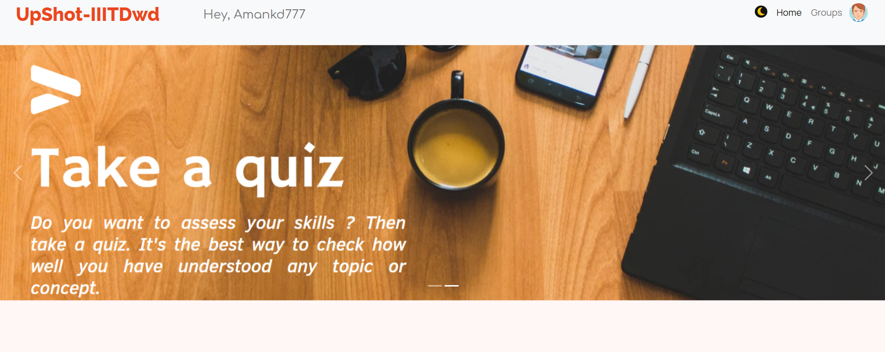
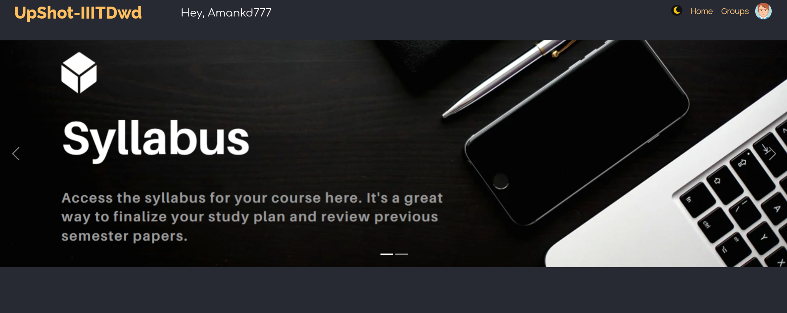
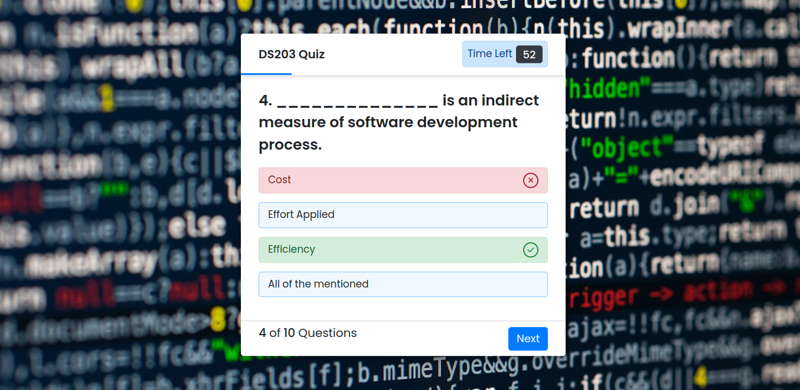
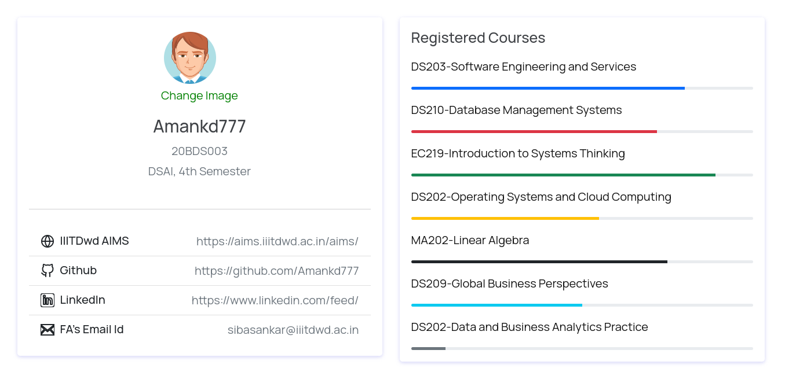
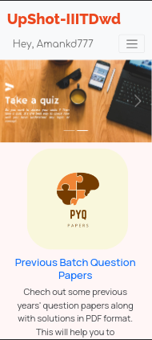

# UpShot-IIITDwd-Academic-Booster

UpShot is a prototype frontend website designed to serve as a one-stop destination for IIIT Dharwad students. It offers features such as access to tests, files, notes, group creation, and a unique profile section. Please note that this project represents the design and prototype stage, and there are no immediate plans for further development or backend integration.

## Features

- **Access to Resources:** Explore a curated collection of educational materials, including tests, files, and notes, to support your academic journey.
- **Group Creation:** Collaborate with fellow students by creating study groups, enabling seamless knowledge sharing and discussions.
- **Profile Section:** Customize your profile, providing information about your academic interests and achievements.

## Screenshots
<p float="left">
    
    
    
    
</p>


## Installation

As this project is a frontend prototype, there is no specific installation required. Simply open the `index.html` file in a web browser to explore the prototype.

## Usage

1. Clone this repository:

    ```bash
    git clone https://github.com/Amankd777/UpShot-IIITDwd-Academic-Booster.git
    cd UpShot-IIITDwd-Academic-Booster
    ```

2. Open the `index.html` file in your preferred web browser.

3. Navigate through the different sections of the prototype: Home Page, Resources, Group Creation, and Profile.

## Contributing

This project is currently in a prototype stage, and no active development or contributions are planned at the moment.

## Credits

- [HTML](https://developer.mozilla.org/en-US/docs/Web/HTML)
- [CSS](https://developer.mozilla.org/en-US/docs/Web/CSS)
- [JavaScript](https://developer.mozilla.org/en-US/docs/Web/JavaScript)

---

**Note:** UpShot is a prototype and design representation of a frontend website for IIIT Dharwad students. It does not offer actual functionality or backend integration.
